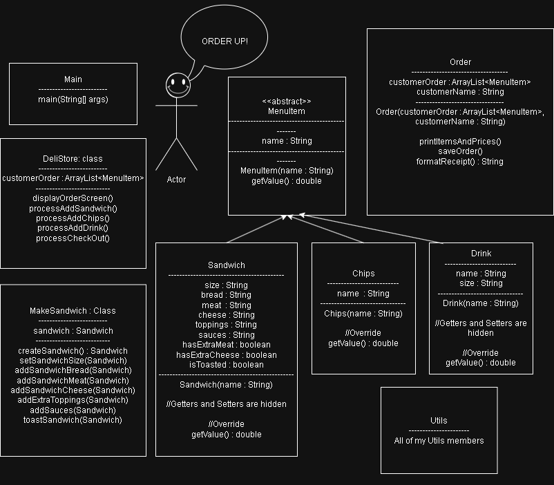

# The Dev Deli

## Table of Contents

- [Description](#description)
- [Images](#images)
- [Class Diagram](#class-diagram)
- [Usage](#usage)
- [Testing](#testing)
- [Featured Code](#featured-code)
- [License](#license)
- [Contributing](#contributing)
- [Questions](#questions)

## Description

- Dev Deli is a command line application, created using java, that is the point of sales application for The Dev Deli, a
  custom sandwich shop. Up until the creation of this app,
  The Dev Deli has been managing orders using paper and pen. However, with Dev Deli application, the order process can
  now be automated.

---

- In the Dev Deli application, a user can log a customers order, which includes the items a customer orders and the name
  of the customer.
- When an order is confirmed and completed, the order receipt is saved to a new file and kept in the /receipts
  directory. A receipt includes the customers name, all ordered items, the price for each item, as well as the total
  price for the order. The name of a receipt file is the date and time the receipt was created, formatted as
  yyyyMMdd-hhmmss.

---

- The items that a user can add to an order include sandwiches, drinks, and chips. Also, a user can add multiple items
  of the same type (ex: 2 chips or 3 drinks) to their order.
- Drinks can be customized by the type of drink, and the size of the drink.
- Chips are added by the bag and can be customized by the type of chips.
- Sandwiches can be customized by size (4", 8" or 12"), type of bread, type of meat, option for extra
  meat, type of cheese, option for extra cheese, toppings, sauces, and an option for the sandwich to be toasted.
- A user can also add one of the signature sandwiches the shop sells to an order, or they can create their own and fully
  customize a sandwich to add.
- After a user chooses one of the signature sandwiches, or chooses to create their own sandwich and goes through the
  process of
  customizing a sandwich, the application confirms that everything on the sandwich is correct before adding it to the
  order.

---

- When a user is done adding items to their order, they can check out. When checking out, the full order, including
  price for each item and total price of the order, are displayed to the user. From there the user has the option to
  confirm the order is correct before writing the order to a new receipt .txt file.
- Prices for all items vary, but the Dev Deli application keeps track of the prices for each item, as well as the total
  price of the order.

## Images

___

___
___

___
___

___
___

## Class Diagram

---

## Usage

#### To Run the Application:

___

1) Clone the repository code to your local workspace.
2) Open the Main.java class (TheDevDeli/src/main/java/Main.java).
3) Run the Main.java class (Green arrow in the upper right corner)
4) Follow the prompts that are given and select the number that goes with your desired option.
5) Receipts for completed orders are kept in /TheDevDeli/src/main/receipts directory, named based on the time they were
   written (yyyyMMdd-hhmmss).

## Testing

---

- This application contains unit tests to test that the prices of multiple combinations of sandwiches are calculated
  correctly. It also contains unit tests to test that the prices of drinks with different sizes are calculated correctly.
- All unit tests use JUnit5.
--- 

#### How To Use the Unit Tests

---

1) Navigate to /TheDevDeli/src/test/java/DrinkTest.java 
2) Or navigate to /TheDevDeli/src/test/java/SandwichTest.java
3) Run the file to execute tests

## Featured Code

---

- One piece of code, or class, that I am proud of is the abstract MenuItem class, which is the parent of
  the Sandwich, Drink, and Chips classes. Because of this, I was able to use only one list (of MenuItem objects) to
  handle cases where the user was adding items to an order, and printing out the final order and writing the final order
  to a receipt file.

- Another thing about this application that I am proud of is the class relationships and structure, specifically the
  UserInterface and DeliShop class. I spent a long time separating the UI from the logic. I used the UserInterface to
  handle all interactions with the user (duh), and used the DeliShop class to handle mostly all the logic.

- Lastly, I am proud of the User Interface. By spending time to design the menu's and options printed out the user,
  and implementing emojis and colors, I was able to make the UI elegant and esthetical. Also, I spent a lot of time and
  lines of code to make sure the error handling of the UI was really well done. For instance, if a user misclicks or
  somehow enters an input outside the scope of what the UI was asking for, the application doesn't shut down or revert
  back to a main menu and cancel a process the user was in the middle of.

## License

There is no license for this application.

## Contributing

### Please contribute to this project:

- [Submit Bugs and Request Features you'd like to see Implemented](https://github.com/krosengr4/capstone-2/issues)

## Questions

- [Link to my GitHub Profile](https://github.com/krosengr4)

- For any additional questions, email me at rosenkev4@gmail.com
