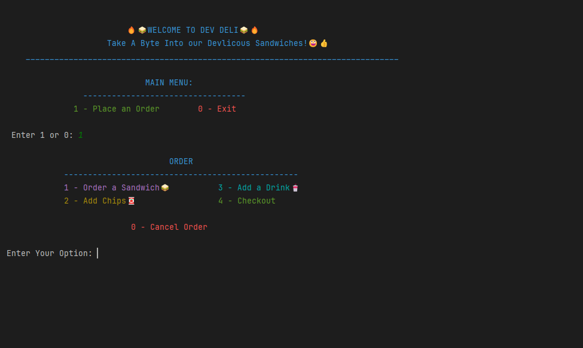
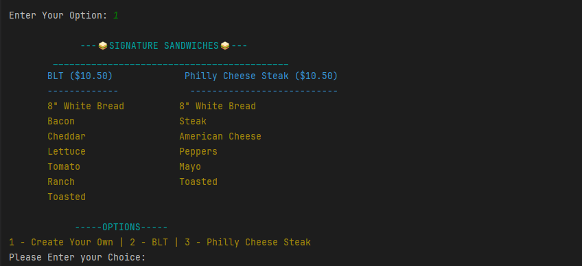
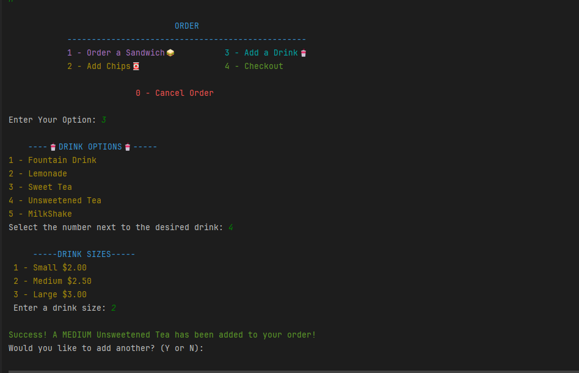
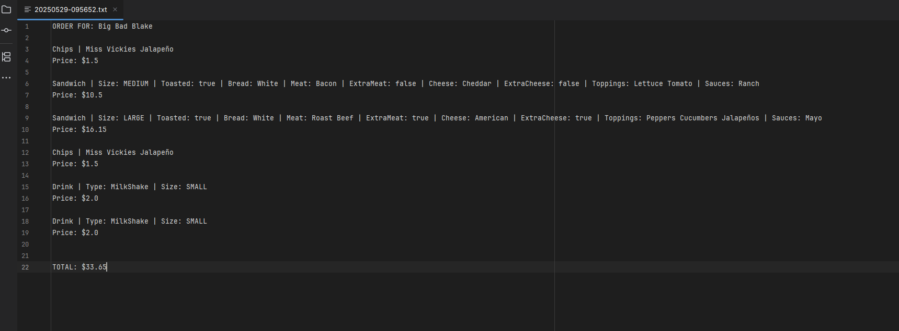

# The Dev Deli

## Table of Contents

- [Description](#description)
- [Images](#images)
- [Usage](#usage)
- [Featured Code](#featured-code)
- [License](#license)
- [Contributing](#contributing)
- [Questions](#questions)

## Description

- Dev Deli is a command line application, created using java, that is the point of sales application for The Dev Deli, a
custom sandwich shop. Up until the creation of this app,
The Dev Deli has been managing orders using paper and pen. However, with Dev Deli application, the order process can now
be automated.
---
- In the Dev Deli application, a user can log a customers order, which includes the items a customer orders and the name
of the customer. When an order is completed, the receipt of
all orders are saved to a file and kept in the receipts' directory. A receipt includes the customers name, all ordered
items, the price for each item, as well as the total price for the order. The name of a receipt file is based on the
time the receipt was created, formatted as yyyyMMdd-hhmmss.
---
- The items that a user can add to an order include sandwiches, drinks, and chips. A user can either add one of the
signature sandwiches the shop sells, or they can fully customize a
sandwich to add. Sandwiches can be customized by size (4", 8" or 12"), type of bread, type of meat, option for extra
meat, type of cheese, option for extra cheese, toppings, sauces,
and an option for the sandwich to be toasted. Drinks can be customized by the type of drink, and the size of the drink.
Chips are added by the bag and can be customized by the type of chips.
---
- Once a user has finished creating a sandwich, they can confirm that the sandwich is correct before adding it to an
order. Once an order is completed, a user can confirm that the order is correct before writing it to a receipt.
Prices for all items vary, but the Dev Deli application keeps track of the prices for each item, as well as the total
price of the order.

## Images

___

___
___

___
___

___
___

## Usage

#### To Run the Application:

___

1) Clone the repository code to your local workspace.
2) Open the Main.java class (TheDevDeli/src/main/java/Main.java).
3) Run the Main.java class (Green arrow in the upper right corner)
4) Follow the prompts that are given and select the number that goes with your desired option.
5) Receipts for completed orders are kept in /TheDevDeli/src/main/receipts directory, named based on the time they were
   written (yyyyMMdd-hhmmss).

## Featured Code

- One piece of code, or class, that I am proud of is the abstract MenuItem class, which is the parent of
  the Sandwich, Drink, and Chips classes. Because of this, I was able to have one List of MenuItem objects
  (sandwich, drink, or chip) for a customers order. This made it easy when calculating the total price,
  printing out a users order, and writing the order to a receipt.

- Another thing about this application that I am proud of is the class relationships and structure, specifically the
  UserInterface and DeliShop class. I spent a long time separating the UI from the logic. I used the UserInterface to
  handle all interactions with the user (duh), and used the DeliShop class to handle mostly all the logic.

## License

There is no license for this application.

## Contributing

### Please contribute to this project:

- [Submit Bugs and Request Features you'd like to see Implemented](https://github.com/krosengr4/capstone-2/issues)

## Questions

- [Link to my GitHub Profile](https://github.com/krosengr4)

- For any additional questions, email me at rosenkev4@gmail.com
